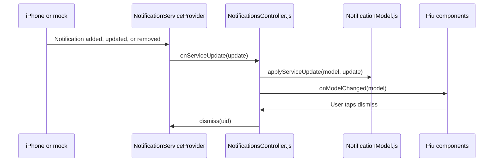

# Apple Notification Center Service notifications app

A 240x320 Moddable Piu notification viewer for Apple Notification Center Service (ANCS). New iPhone notifications are
added at the top of a scrollable stack. A red dismissal button sends the notification's ANCS negative action when that
action is available. Each card shows the local time when the notification was received.
The header shows the current local time beside the BLE connection icon.

The simulator uses a mock notification service so the complete UI and dismissal flow can be tested without BLE
hardware. ESP32 builds use the reusable [`modules/ancs`](../../modules/ancs/) implementation for pairing, reconnects,
notification retrieval, app-name caching, and actions.

## Simulator

Build from the repository root:

```sh
npm run build:ancs:sim
```

To start the debugger:

```sh
npm run debug:ancs:sim
```

The mock connects automatically, adds sample notifications over time, and adds another notification every seven
seconds. Tap the red `x` to verify that an actionable notification is removed. A gray `x` indicates that the source
notification did not expose a negative action.

Received and updated notification attributes, dismissal requests, and removals are written to the debugger log.

## ESP32

ANCS requires an ESP32 target with BLE support. Build and run from this example directory:

```sh
mcconfig -d -m -p esp32/moddable_two
```

Open **Settings > Bluetooth** on the iPhone and pair with **Moddable Notifications**. After the client reconnects, allow
notification sharing if iOS asks. Incoming and modified notifications then appear in the app.

The app never performs an action automatically by default. Tapping an enabled dismissal button explicitly invokes
`ANCSService.performAction(uid, "negative")`. Not every notification exposes that action, and the notification remains
visible until iOS reports that it was removed.

For unattended hardware testing only, an explicit build setting can act on each supported notification:

```sh
mcconfig -d -m -p esp32/moddable_two ancsAction=positive
mcconfig -d -m -p esp32/moddable_two ancsAction=negative
```

## Application data flow


